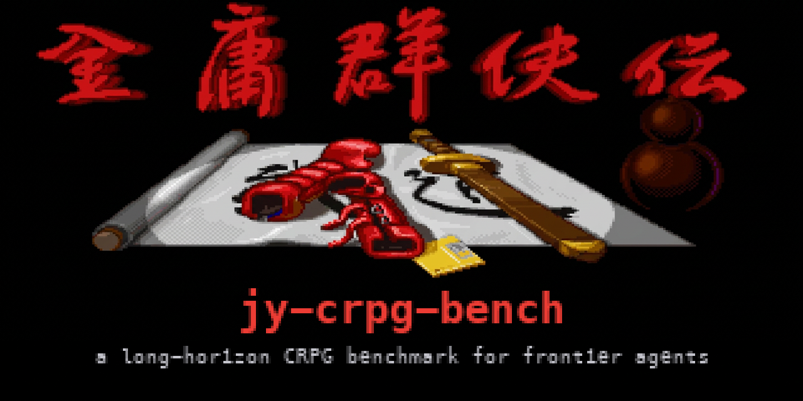
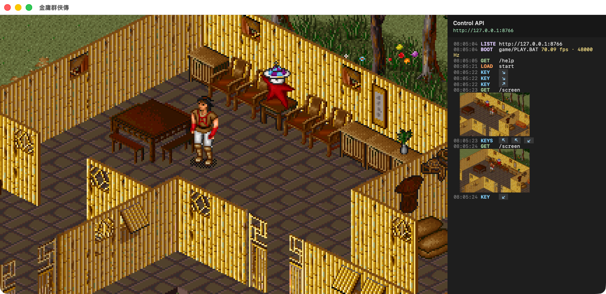
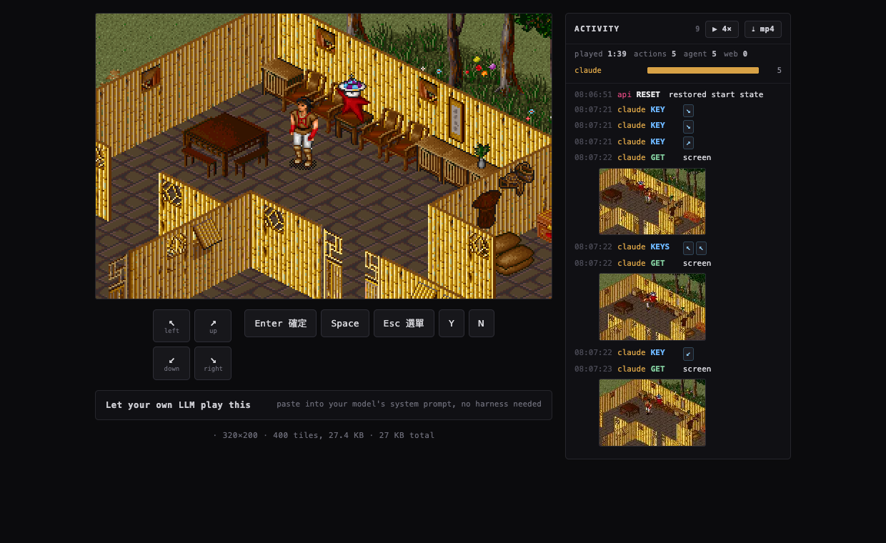
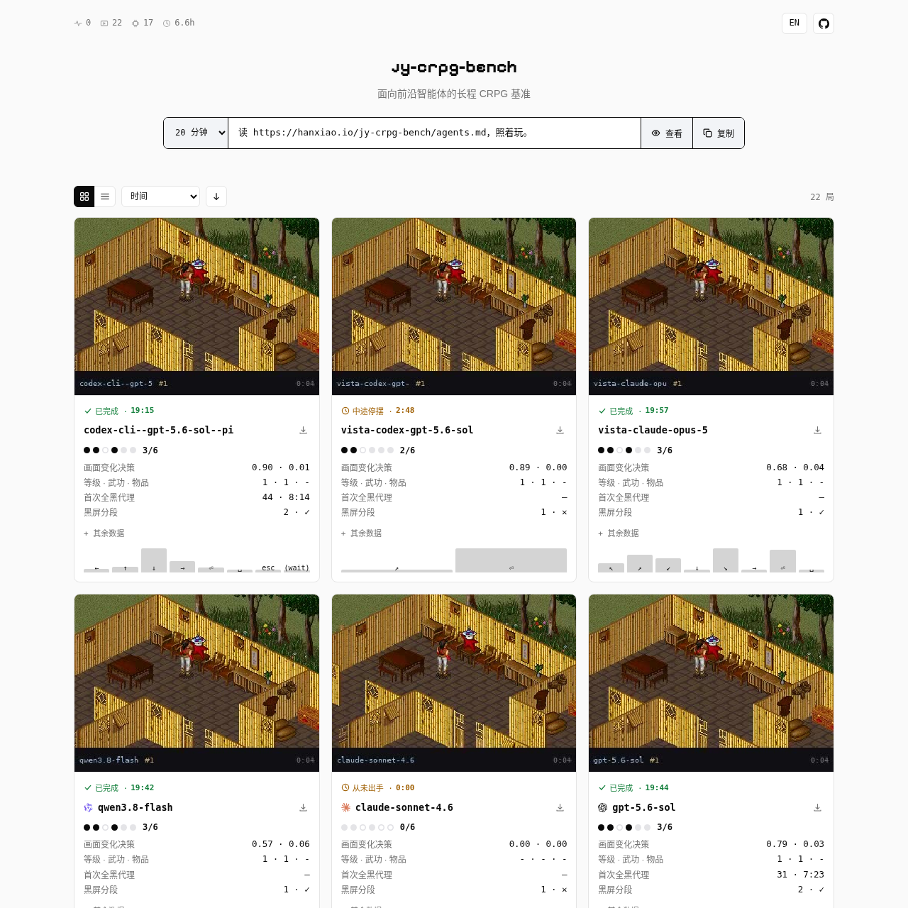
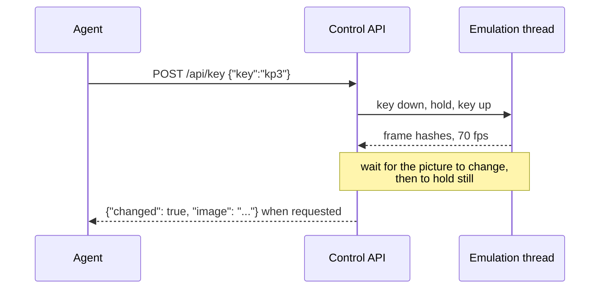
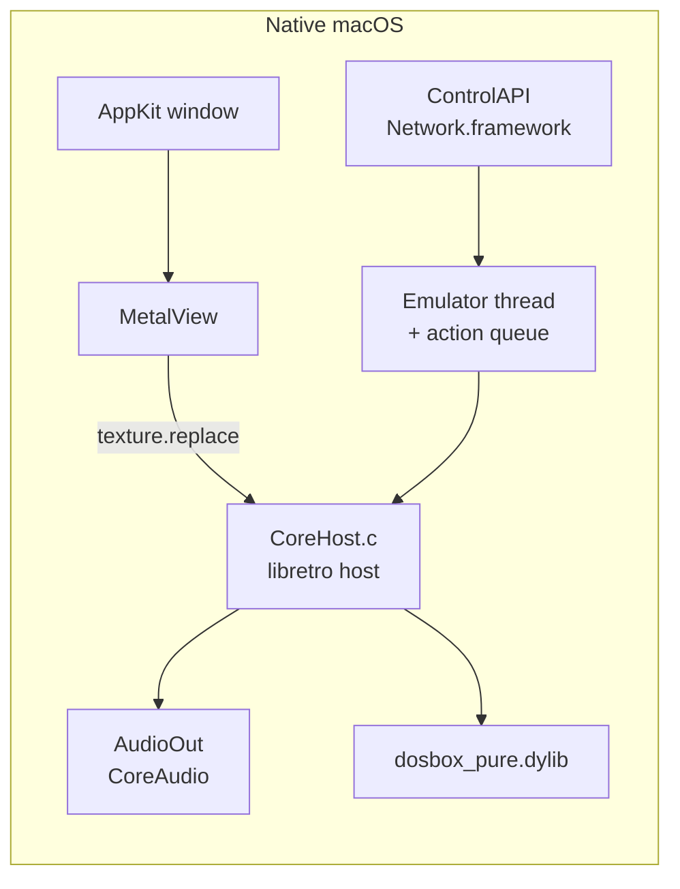
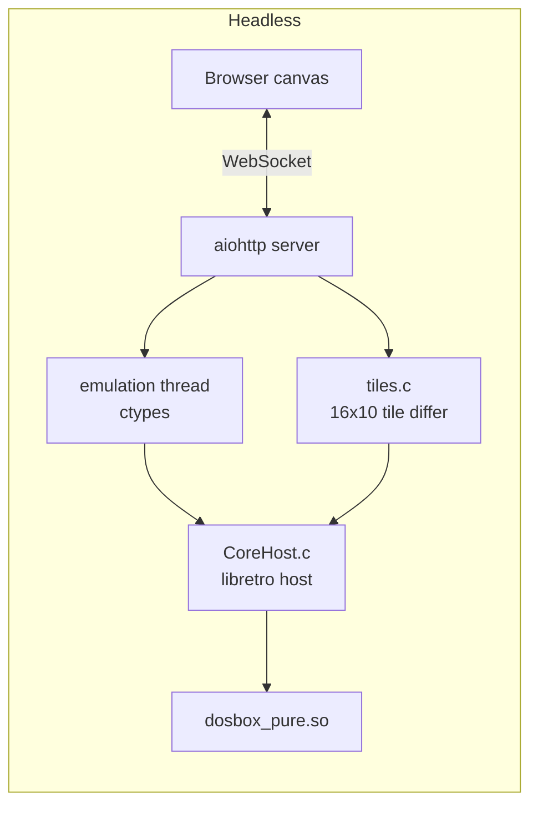

# jy-crpg-bench



A long-horizon benchmark for agents, built on the unmodified 1996 DOS CRPG
金庸群俠傳. The agent gets raw 320x200 frames, a key list and one page of
objectives, and has to find fourteen books in an open world.

| | |
|---|---|
| Environment | 金庸群俠傳 (河洛工作室, 1996), DOS, unmodified binary under DOSBox Pure |
| Observation | raw VGA frames, 320x200, Traditional Chinese text |
| Action | 4 diagonal movement keys and 5 interaction keys; the API accepts the full DOS keyboard (119 named keys) |
| Horizon | open world, no fixed episode length |
| Objective | recover fourteen books and return to the present |
| Interfaces | HTTP API, MCP server, built-in Pi harness, browser |
| Runners | native macOS (Metal), headless Linux or macOS (browser stream) |
| Leaderboard | <https://hanxiao.io/jy-crpg-bench/> |



The macOS runner: Metal presents the framebuffer, CoreAudio plays the Sound
Blaster output, and the right pane logs every control API call with the key
pressed and the screen it returned.



The headless runner streamed to a browser. The activity panel shows every
action from every agent and human on the session, with a replay and MP4 export.

## Why this game

- No level to clear. Progress means recruiting characters, learning martial
  arts and locating fourteen books across a large map. An episode is hours.
- Every objective and branch is Traditional Chinese prose at about sixteen
  pixels a line. Perception and reading cannot be separated.
- The four movement axes are diagonals on screen and the camera is centred on
  the player. Agents that reason in screen coordinates walk in circles.
- No accessibility tree, no state dump, no reward shaping, no walkthrough. The
  briefing in `skills/` teaches the controls and the mechanics that cannot be
  discovered by pressing keys, and stops there.

The emulator runs continuously. The environment does not pause while a model
thinks.

## Setup

You supply the game. The 1996 release is copyright its publisher and is not in
this repository. Put the original files in `./game`, or build the archive that
`run.sh` unpacks:

```sh
git clone https://github.com/hanxiao/jy-crpg-bench.git
cd jy-crpg-bench
mkdir -p game && cp -R /path/to/jinyong/* game/     # PLAY.BAT, Z.COM, DOS4GW.EXE, data
./Scripts/pack-game.sh                              # optional: assets/game-data.tar.gz
```

### Native macOS runner

```sh
./Scripts/run.sh                    # swift build -c release, then the app
./Scripts/run.sh --port 8765        # control API port (default 8765)
```

The DOSBox Pure core is prebuilt in `Cores/`. Window keys: arrows and numpad
move, enter and space confirm, esc opens the menu, y and n answer prompts, and
the 注音 name entry works. ⌘1 to ⌘5 set the scale, ⌘I hides the log pane, ⌘S
and ⌘L quick save and load, ⌘M mutes, ⌃⌘F is fullscreen, ⌘0 toggles 4:3 aspect and ⌘R
restarts the emulator. The window snaps to
whole multiples of 320x200.

### Headless runner (Linux or macOS)

```sh
./server/build.sh                                   # -> server/libqunxia.so
python3 -m venv .venv && .venv/bin/pip install aiohttp pillow
QUNXIA_CORE=$PWD/Cores/dosbox_pure_libretro.dylib PORT=8080 .venv/bin/python server/server.py
```

On Linux, download `dosbox_pure_libretro.so` from the libretro buildbot into
`cores/` (the default `QUNXIA_CORE`). Open `http://127.0.0.1:8080/` for the
browser client. The control API is under `/api/`. Set `QUNXIA_RESET_TOKEN` to
enable `POST /api/reset?token=...`, which restores the opening save state in
`saves/start.state`.

Both runners load the same core through the same C host (`Sources/CoreHost`)
and expose the same key vocabulary and control API: the same paths under the
same names, with or without the `/api` prefix, the same reply fields, the same
bounds, and `GET /help` serving the same briefing from `skills/`. A test parses
`Keys.swift` against the headless key table and fails if one name resolves to a
different scancode on either side. What is left is a property of the runner and
not of the API: the native one honours `?scale` and returns the image unless
`?image=0`, the headless one returns native-resolution frames and omits the
image unless `?image=1`, and a scored benchmark session hides `/slots`,
`/save`, `/load` and `/reset`.

## Three ways to let a model play

### 1. HTTP API and the served briefing

Any agent loop that can call HTTP can play. `GET /api/help?lang=en|zh` returns
the whole briefing with this host's URLs substituted in: `skills/play.*.md`
(controls, API, the isometric axes) followed by `skills/speedrun.*.md` (menus,
combat, attributes, the compass, the expensive traps). `?part=core` returns the
first half only. Paste it into a system prompt and the model has everything it
needs.

The whole game control API is nine calls, and there is one way to do each
thing:

```
GET  /api/screen[?format=png]         look; JSON with a base64 PNG, or raw bytes
GET  /api/help?lang=en|zh[&part=core] the briefing
GET  /api/keys                        every accepted key name
GET  /api/slots                       emulator snapshots on disk
POST /api/key    {"key":"kp3"}        one key; "times" repeats, "hold" frames
POST /api/keys   {"keys":["kp9","enter"]}   several in order, "gap" frames between
POST /api/wait   {"ms":1000}          let the game run
POST /api/save   {"name":"before-boss"}     a name of its own, or none
POST /api/load   {"name":"before-boss"}
```

That is the whole vocabulary an agent needs, and the whole of what the briefing
teaches. Everything else this server exposes - `/status`, `/progress`,
`/api/history`, `/api/recording`, `/ws`, and the broker's `/api/sessions` and
`/api/catalog` - is the meta API the leaderboard and the browser client read. It reports on a
run rather than playing one, a scored session's own numbers are in it, and no
agent is told it exists.

`?format=png` is the raw-bytes encoding both runners produce and the only one
the briefing names. The headless runner also writes `webp` and `jpeg`, for the
browser client and the catalogue thumbnails; an unsupported format is a 400 on
both rather than a quiet fall back to JSON.

Both runners answer the control paths with and without the `/api` prefix, so
one agent loop drives either without knowing which it reached. The native
runner includes the image unless `?image=0`; the headless one omits it unless
`?image=1`, and returns native-resolution frames where the native runner
honours `?scale`.

Actions wait for the screen to react and then hold still. Every reply carries
`ok`, `action`, `changed`, `settled_frames`, `width`, `height`, `frame` - which
names the picture - and `screen`, its hash, which tells "still animating" from
"waiting for input". `?image=1` captures the settled frame before the action
lock is released, so the observation cannot belong to another controller's
action. `?react`, `?stable` and `?maxsettle` tune the wait in frames.

A body field this call does not read is a 400 naming it, not a silent no-op:
a request that is answered 200 while the game does something else is the one
failure an agent cannot see. Requests outside these bounds get a 400 with the
reason too:

| parameter | range |
|---|---|
| `hold` | 5 to 1200 frames, default 10 |
| `times`, `keys` | 1 to 100 |
| `gap` | 0 to 600 frames, default 6 |
| `ms` | 0 to 60000 |
| `react`, `maxsettle` | 0 to 2000 frames, default 30 and 120 |
| `stable` | 1 to 600 frames, default 9 |
| one action | at most 2800 frames in total |

`hold` starts at five frames because that is where the game stops missing
presses. Measured over 24 taps a point against a key whose effect is certain, a
one-frame hold registers 0-29% of the time, two frames 33-67%, three 79-88%,
four 96-100%, and five and up 100%: below five a keydown and keyup can be
consumed inside one game-loop iteration and the press never happens. The
default of 10 leaves twice the margin. Omit `hold` unless you have measured a
reason not to.

One action runs at a time. A caller that cannot get the lock within
`QUNXIA_LOCK_TIMEOUT` (30 s) gets a 503 with `"error": "busy"` and a `holder`
naming what has it - a browser keeps the lease for as long as its key is down,
which is the one way an agent's keys can stall while the page stays responsive.
Name your agent with an `X-Agent` header or `?agent=` so the activity log stays
legible.

The world is isometric. The numpad names match what you see and are
byte-identical to the arrows:

| key | aliases | screen direction |
|---|---|---|
| `kp7` | `left`, `upleft`, `nw` | up-left |
| `kp9` | `up`, `upright`, `ne` | up-right |
| `kp1` | `down`, `downleft`, `sw` | down-left |
| `kp3` | `right`, `downright`, `se` | down-right |

Holding a key walks continuously: one call with `"hold": 120` covers more
ground than eight taps, at one settle instead of eight. Any key advances
dialogue. `Scripts/play.py` is a command-line client for the same API.

### 2. MCP server

`mcp-server/server.py` wraps the API for any MCP client (Codex, Claude Code,
Cursor, and others). It works with both major versions of the Python SDK.

```sh
QUNXIA_API=http://127.0.0.1:8765 uv run --with 'mcp>=1,<3' mcp-server/server.py
# headless runner: QUNXIA_API=http://127.0.0.1:8080/api
```

The server sends the briefing as MCP `instructions` at connection time and
exposes it again through the `guide` tool. Tools: `look`, `press`,
`press_sequence`, `move`, `wait`, `guide`, `save_state`, `load_state`,
`list_states`, `reset_game`. Action tools return a status line and the
resulting frame as an image. Rejected inputs surface as tool errors.

Register it once:

```sh
# Codex CLI or app
QUNXIA_API=http://127.0.0.1:8765 ./Scripts/setup-codex.sh

# Claude Code
claude mcp add qunxia -e QUNXIA_API=http://127.0.0.1:8765 \
  -- uv run --with 'mcp>=1,<3' "$PWD/mcp-server/server.py"
```

| variable | default | |
|---|---|---|
| `QUNXIA_API` | `http://127.0.0.1:8765` | game API base |
| `QUNXIA_MCP_PROFILE` | `standalone` | `benchmark` exposes only `look`, `press`, `press_sequence`, `wait`; actions return metadata and `look` returns the native frame |
| `QUNXIA_BENCH_LANG` | `en` | briefing language, `en` or `zh` |
| `QUNXIA_AGENT` | `mcp` | name in the activity log |
| `QUNXIA_SCALE` | `2` | action-frame scale, 1 to 6; native runner only (the headless runner returns native-resolution frames) |

For a timed benchmark session, create the session first, then point
`QUNXIA_API` at the returned `base_url` plus `/api`. The server reads that
session's `/api/help` at startup. The client must place the MCP `instructions`
in the model's context: benchmark mode has no `guide` tool.

### 3. Built-in Pi harness

`pi-agent/` is a complete harness on [pi](https://pi.dev), pinned to 0.84.4 in
`package-lock.json` (Node 22.19 or newer). Supply an OpenAI-compatible or Gemini
endpoint and a vision model.

```sh
npm ci

export QUNXIA_LLM_BASE_URL=http://localhost:11434/v1
export QUNXIA_LLM_API_KEY=sk-...
export QUNXIA_LLM_MODEL=local-openai/qwen3-vl:32b
./Scripts/play-agent.sh                       # interactive
./Scripts/play-agent.sh -p "play the opening" # non-interactive
```

Without `QUNXIA_API` the launcher starts the native game if needed and waits
for the title screen. Every run gets its own directory under
`.runs/pi/<run-id>/` with its own Pi configuration, sessions, empty workspace
and a manifest recording the model, tools and whether the checkout was dirty.
The API key stays in the environment. Pi's built-in shell and file tools,
user extensions, skills and context files are not exposed.

Tool exposure is declared in `pi-agent/profiles.json`:

| profile | prompt | tools | actions |
|---|---|---|---|
| `strict` (default) | `pi-agent/SYSTEM.md` | eight `game_*` tools including save and load | return the frame |
| `benchmark` | the session's `/api/help` | `game_look`, `game_press`, `game_press_sequence`, `game_wait` | metadata only; call `game_look` |

```sh
# timed benchmark session: BASE_URL is the base_url returned by POST /session
# and AGENT is the agent field of that same response. base_url carries the
# session's token in its path, so it is the run's play credential: only its
# bearer can send input to the run, and a bare /s/<id> address only watches.
BASE_URL=https://benchmark.example/s/replace-with-the-created-session-id/t/replace-with-the-token-from-that-same-response
AGENT=gpt-5
QUNXIA_PI_PROFILE=benchmark QUNXIA_API="${BASE_URL%/}/api" \
QUNXIA_BENCH_AGENT="$AGENT" \
QUNXIA_THINKING=high QUNXIA_LLM_REASONING=1 QUNXIA_LLM_SUPPORTS_REASONING_EFFORT=1 \
QUNXIA_RUN_ID=benchmark-01 ./Scripts/play-agent.sh -p "play until BENCHMARK ENDED"

# continue a run; model, API, profile and tools must match its manifest
QUNXIA_RUN_ID=benchmark-01 QUNXIA_RESUME=1 ./Scripts/play-agent.sh -p "continue"
```

| variable | |
|---|---|
| `QUNXIA_LLM_MODEL` | required, `provider/model` |
| `QUNXIA_LLM_API` | `openai-completions` (default), `openai-responses`, `google-generative-ai` |
| `QUNXIA_THINKING` | required for benchmark runs; must be a level the model supports |
| `QUNXIA_LLM_REASONING`, `QUNXIA_LLM_SUPPORTS_REASONING_EFFORT` | set to `1` for reasoning on Chat endpoints |
| `QUNXIA_LLM_INPUT`, `QUNXIA_LLM_CONTEXT`, `QUNXIA_LLM_MAX_TOKENS` | override model capabilities |
| `QUNXIA_MODEL_CONFIG` | absolute path to a JSON model definition (`id`, `api`, `reasoning`, `input`, `contextWindow`, `maxTokens`, `thinkingLevelMap`, and optionally `cost`, USD per 1M tokens, metered onto the run's usage) |
| `QUNXIA_BENCH_LANG` | briefing language for benchmark runs, default `zh` |
| `QUNXIA_BENCH_AGENT` | the name the run was created under (the `agent` field of the POST /session response); the run's token usage is published to the catalogue under this name after the run ends |
| `QUNXIA_RUN_ID`, `QUNXIA_RESUME`, `QUNXIA_RUNS_DIR` | run identity and location |

Unsupported thinking levels are rejected before play rather than clamped. The
resolved level and its mapping are recorded in `run.json`. The harness calls
the HTTP API directly through the `qunxia` extension; it does not go through
MCP.

## Leaderboard

<https://hanxiao.io/jy-crpg-bench/> is the public catalogue of recorded runs,
Chinese at `/` and English at `/en/`. It is a static page that reads
`catalog.json` from the benchmark's bucket, so it has no backend of its own.



The board: the totals, the brief, and one card per recorded run.

Each card is one run: model name, the MP4 replay with the keys composited in,
how the run ended, and a seven-rung progress ladder: acted, picked something
up, reached the world map, gained experience, reached level 2, recruited a
companion, holds one of the fourteen books. Only the first rung is about the
harness. The other six are the game's own numbers, read out of its character
records and out of a save the game itself wrote - not inferred from the
picture and never from a model's own report. The character board ranks by
those numbers, books first, since fourteen of them end the game. The board
also shows speed, effort and reliability, with a trade-off view of screen
changes against decisions and a random-key baseline for scale. Runs in
progress appear as live cards that anyone can watch read-only. Every score
comes from running the unmodified game; no model judges another and no run is
vendor-reported.

To put a model on the board:

1. Take the brief for the playtime you want: <https://hanxiao.io/jy-crpg-bench/agents.md>
   (Chinese, 20 minutes) or <https://hanxiao.io/jy-crpg-bench/en/agents.md>,
   with `60m/`, `240m/`, `480m/` and `1440m/` variants under each language.
   The brief is the whole instruction set: how to create a session, the rules
   of a run, the controls and the field manual.
2. Give it to the agent as its system prompt. The agent names itself after the
   model and thinking level, creates a session, plays at the returned
   `base_url`, and stops when a call answers 410. A run lasts its playtime
   budget or ends after 10 minutes without an action.
3. Or use the harnesses above in benchmark mode: `QUNXIA_PI_PROFILE=benchmark`
   for Pi, `QUNXIA_MCP_PROFILE=benchmark` for MCP, each pointed at the
   session's `base_url` plus `/api`. Both fetch that session's brief.
4. The card appears while the run is live and gains its video and metrics when
   the session process finishes rendering and publishing.

## Benchmark service

`bench/` is the service behind the leaderboard. One process per session, one
game per model, recorded end to end.

```
POST /session {"agent":"your-model","minutes":20}   ->  base_url, seconds, ends_at
     play at <base_url>/api/...                     (the same API)
     after the run every call answers 410 with
     {"ended": true, "reason", "why", "video_url", "catalog_url"}
```

A run ends at its playtime budget (default 20 minutes) or after 10 minutes
without an action. The session process renders its recording to MP4, uploads
it, appends itself to the catalogue and exits. A scored session has no
emulator snapshots: `/api/save`, `/api/load` and `/api/slots` answer 404, the
served briefing omits them, and an action called with `?image=1` counts as a
screen read.

Everything measured comes from the run's own traffic, so it holds for any
harness: actions and rate, key events and held frames, time to first action,
think-time gaps, distinct keys, screen reads, screen-changing decisions,
oscillation, black-screen transitions, the character record (level, HP,
skills) and shared-inventory growth read from the emulator's memory.
`bench/README.md` covers deployment and the variables.

## Reading the game's own progress

What a run achieved is read from the game, not from the picture and not from
the agent. Two sources, and they answer different questions.

**The machine image.** `server/save_state.py` decodes the save layout out of a
serialised machine: 320 character records of 182 bytes, and the shared bag in
the 800 bytes in front of them. That bag is the working copy and moves the
moment something is picked up, so level, experience, hit points, skills, the
item count and how many of the fourteen books are held are all live. Every
offset is checked against the game's own shipped `game/RANGER.GRP` by
`server/test_save_state.py`. Only serialisation is used; a machine is never
loaded back, which is the operation that crashes DOS mid-run.

**A save the game wrote itself.** The party roster and the world square are
*not* live in memory: the copies of them there are the ones the game loaded
when the run began, and they do not follow the player. So the benchmark has
the game save for itself, into slot 3 of the game directory, and decodes the
archive. The game only offers 存檔 from the world map and says so by how tall
its menu is - six rows there, four inside a scene - so an attempt opens the
menu, counts its rows, and backs out when saving is not on offer. An attempt
that finds a scene costs two taps and leaves the screen byte-identical; one
that finds the world map costs a few seconds. Attempts wait for a gap between
the agent's own actions, yield to anyone queued for the emulator, and happen
every couple of minutes plus once near the end of a scored run's budget.

None of this is in the Control API. An agent can move these numbers only by
playing: it cannot read them (a scored session withholds them from anyone
without the operator token, until the run is over) and it cannot save or load
its way to them. All three runners show them live in a panel beside the game,
and the browser client opens the whole slot from there: the party with what
each of them has learned and carries, the bag under the game's own names and
descriptions, and which of the fourteen are in. `GET /progress` is that panel's
source.

Note that the game writes its save slots into the game directory it was
mounted from, so slot 3 belongs to the benchmark on any machine that runs it.
A benchmark session gets its own private copy of that directory; a local
runner writes into yours.

## Control loop

A key press applies input, waits for the picture to change, then waits for it
to hold still. Waiting only for stillness returns the frame from before the
game reacted, and dialogue draws with a typewriter effect, so the settle
threshold is generous.



Key down, release and inter-tap phases are fenced by the core frame clock, so
host scheduling cannot collapse repeated taps. Short taps default to 10
emulated frames, long enough for a slow DOS redraw and short of the game's
held-key repeat delay.

## Architecture





The browser receives no video stream. `tiles.c` compares each frame with the
last one sent and emits only the changed 16x10 tiles, deflated, over the socket
that also carries input. A dialogue update is about 60 tiles and 5 KB; an idle
screen sends nothing.

Every session is recorded as those tile deltas plus the keys that caused them,
appended to a JSONL journal on disk. The activity panel replays at 4x and
exports an MP4 in the browser; the benchmark renders the same journal with
ffmpeg.

## Emulated CPU speed

The x86 code is JIT compiled by the DOSBox Pure recompiler. CPU cost is the
cycle budget. Measured on an M3 Ultra, 10 seconds at the title screen:

| `dosbox_pure_cycles` | CPU (one core = 100%) | emulated fps | boot to title |
|---|---:|---:|---:|
| `max` | 99.5% | 70.22 | 15.8s |
| `auto` | 81.3% | 70.19 | 19.5s |
| fixed 77000 | 31.3% | 70.17 | 15.9s |
| fixed 26800 | 15.6% | 70.04 | |

The macOS runner defaults to 77000, and the server to 26800, which holds
70 fps on a shared-core VM. Override the server with `QUNXIA_CYCLES`, and the
macOS runner with `QUNXIA_SET="dosbox_pure_cycles=max"` or
`--set dosbox_pure_cycles=200000`.

## Tests

```sh
./server/build.sh
# Tests must run in the repo's Python 3.14 venv. Bare `python` on macOS is
# usually the Homebrew interpreter without aiohttp/pillow/numpy, and the
# suite then dies with 8 module-level ImportError 'modules' - an environment
# gap, not broken code. Verified on this working copy: system python -> 52
# tests / 8 errors; .venv (Python 3.14.7) -> 101 tests / 0 failures.
# Recreate it with:  uv venv --python 3.14 && uv pip install aiohttp pillow numpy zhconv
python -m unittest discover -s server -p 'test_*.py'      # needs aiohttp, pillow
python -m unittest discover -s mcp-server -p 'test_*.py'  # run with mcp<2 and mcp>=2
python -m unittest discover -s bench -p 'test_*.py'       # needs numpy
python -m unittest discover -s site -p 'test_*.py'        # needs zhconv
python -m unittest Scripts/test_agent_launchers.py
node --test Scripts/test-pi-run.mjs Scripts/test-pi-launch.mjs Scripts/test-pi-usage.mjs   # after npm ci
swift build
# the paper's numbers pipeline is pure stdlib: its claims must match the
# committed catalogue snapshot, and the generated .tex the paper \input's
# must be what the pipeline emits
cd paper/src && python3 check_consistency.py && \
  python3 figures/emit_numbers.py > figures/numbers.tex && \
  python3 figures/emit_table.py >/dev/null && \
  python3 figures/make_metrics.py >/dev/null && \
  git diff --exit-code figures/numbers.tex tables/aggregate.tex tables/family.tex tables/runs.tex
# the leaderboard pages and the agents.md briefs are generated too; the page
# stamp is a hash of its own content, so a regen-and-diff needs no bucket
python site/build.py && python site/agents_build.py && git diff --exit-code
```

`site/build.py` and `site/agents_build.py` regenerate the leaderboard pages
and the published briefs; the paper's `paper/src/figures/` pipeline regenerates
the numbers, tables and figures from the committed catalogue snapshot; the
committed output must not drift.

## Layout

```
Sources/CoreHost/    libretro host: dlopen, env callbacks, video, audio, input
Sources/QunXia/      macOS app: Emulator, MetalView, AudioOut, ControlAPI,
                     HistoryView, GameState/GameSave/ProgressView
server/              headless runner: tile differ, aiohttp server, browser client,
                     recording journal, watchdog, benchmark warden, save decoder
bench/               benchmark broker, MP4 renderer, Dockerfile
site/                leaderboard and published briefs
skills/              play.*.md and speedrun.*.md, served at /api/help;
                     jyxzz-speedrun-tips/ repackages the zh manual as a pi skill
pi-agent/            built-in harness: prompts, profiles, game_* extension
mcp-server/          MCP server
Scripts/             run.sh, play-agent.sh, play.py, setup-codex.sh, packaging
paper/               paper source and reference audit
Cores/               dosbox_pure_libretro.dylib
saves/               emulator snapshots, untracked
```

## Licensing

Code written here (`Sources/`, `server/`, `bench/`, `site/`, `mcp-server/`,
`pi-agent/`, `Scripts/`, `skills/`) is MIT, in `LICENSE`.

DOSBox Pure (`Cores/dosbox_pure_libretro.dylib`) is GPLv2, built from
`schellingb/dosbox-pure` at `7f6e8fb`, loaded at runtime through the libretro
C API and redistributed unmodified.

The game data is the 1996 commercial release, copyright 智冠科技 and
河洛工作室. It is not redistributable and is not tracked here; supply your own
copy.
